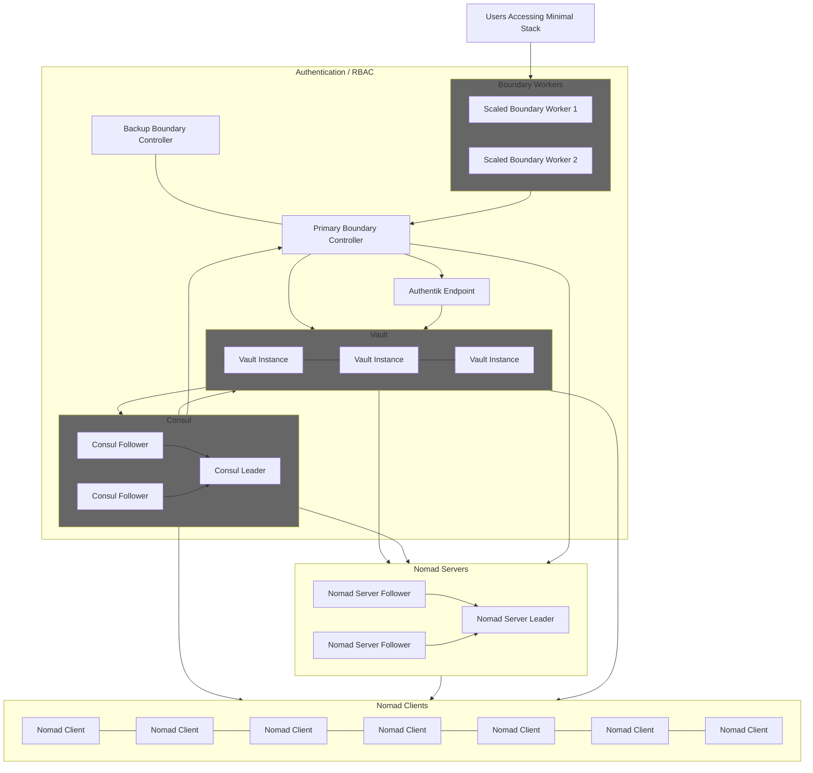

# Minimal Stack is ran using the full Hashicorp Suite of products for orchestration, automation, secret management and more.
The first steps in developing this project was considering what problem I am attempting to solve. Presently, the openstack horizon user interface is difficult for new students to use. It provides a lot of options, and many of them are not necessary to the basic end user. Many students want to host a minecraft server, a personal website, or other basic projects that do not require layers of security groups and rules, routing, server groups, and more. To address this, a new orchestration platform is required- it would be best to personally develop one with only the basic features, but Hashicorp Nomad provides all of the beginner objects a user might want without being overwhelming.

## Service Chart

## How access is managed
Hashicorp Boundary, Vault, and Consul work together to provide secure, consistent, and ephemeral access to users. 

## How orchestration is handled
Hashicorp Terraform is used to provision servers on Openstack, Redhat Ansible is used to configure services. I have not yet addressed how to scale based on usage, as this will never require that, but I will work on adding it for the sake of demonstration. 
